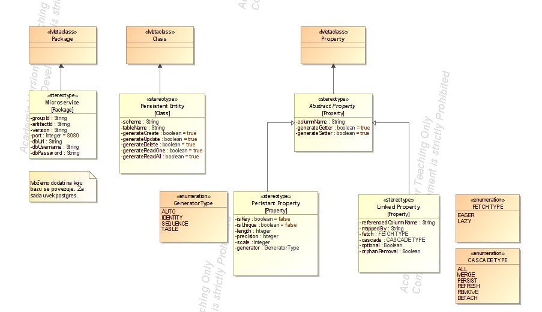

# PluginDevelopment 

## Description

PluginDevelopment is a Java application for generating Micronaut applications created for the purpose of the Agile Software Development Methodology course at the Faculty of Technical Sciences, University of Novi Sad.

## UML Profile

## Instructions

## Technologies used
- MagicDraw 17.0.3 for UML models and profiles
- FreeMarker 2.3.30 for templates

## Contributors

- [Milica Todorović](https://github.com/milicat228)
- [Miloš Krstić](https://github.com/KrsticM/)
- [Jelena Šurlan](https://github.com/jaseyrae9)

